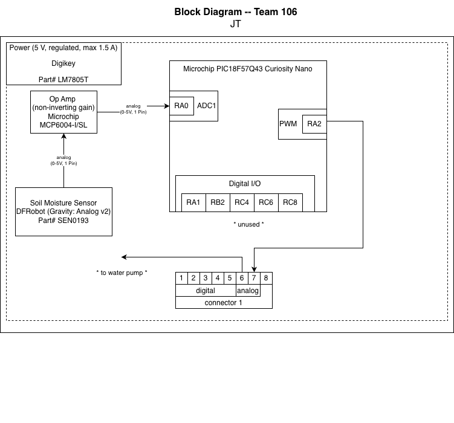

## Overview

This block diagram shows my soil moisture subsystem and how it connects to our team’s plant monitoring system. It runs on a regulated 5 V supply that powers the sensor, op amp, and microcontroller. The sensor sends an analog signal through the op amp before being read by the microcontroller’s ADC on RA0. For system integration, RA2 connects to an 8-pin header that communicates with the water pump subsystem.

## Block Diagram 

**Figure 1:** *Soil Moisture Sensor Subsystem*

[Download Soil Moisture Block Diagram (PDF)](smblock.pdf)
