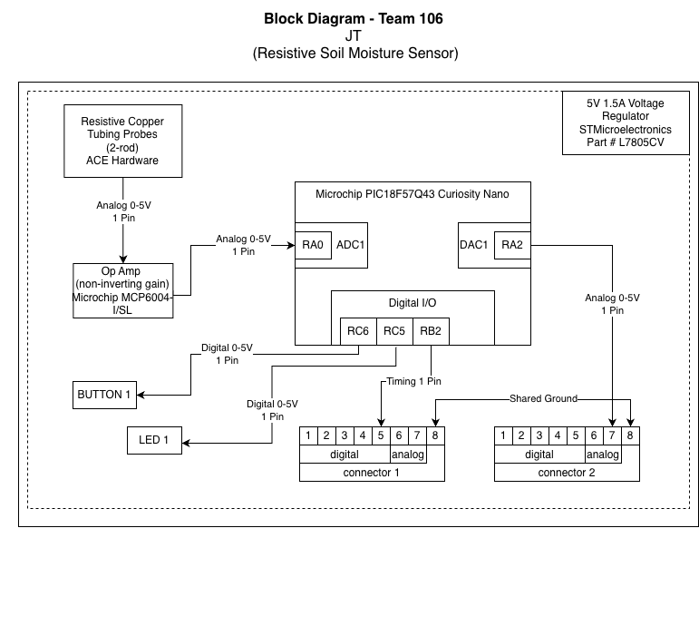

## Overview

This block diagram shows my soil moisture subsystem and how it connects to our team’s plant monitoring system. It runs on a regulated 5 V power supply that powers the sensor, op amp, and microcontroller. The soil probes send an analog signal to the op amp, which strengthens the signal before it is read by the microcontroller on pin RA0. The microcontroller also sends signals through pins RA2 and RB2 for team integration. Both connectors share a common ground and allow communication with the water pump and light sensor to "turn on". Additionally there will be debugging features from in the form of a light and button.

## Block Diagram 

**Figure 1:** *Soil Moisture Sensor Subsystem*

[Download Soil Moisture Block Diagram (PDF)](sft.pdf)
