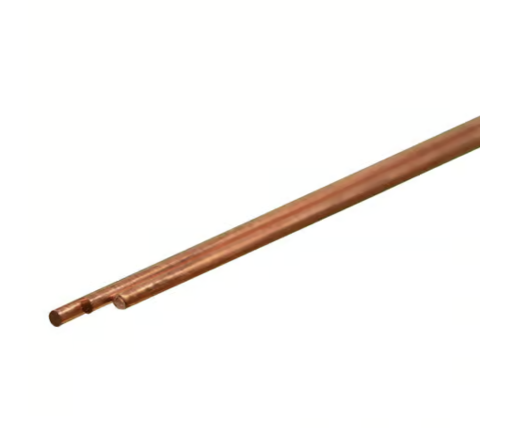
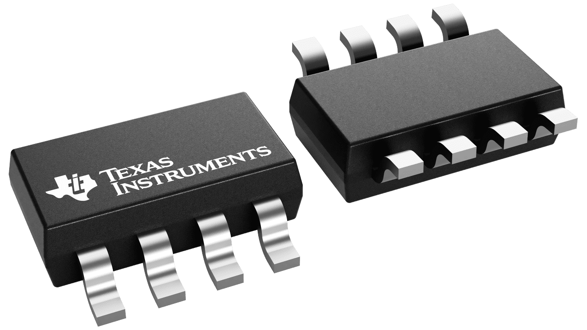

**Description**

This section compares and selects key parts used in the soil moisture subsystem. Each component was chosen based on performance, compatibility with the circuit, cost, and ease of integration. The final selections provide accurate sensing and reliable operation while keeping the design simple and efficient.

**Soil Moisture Sensor (Subsystem)**

| **Solution**                                                                                                                                                                                      | **Pros**                                                                                                                                    | **Cons**                                                                                            |
| ------------------------------------------------------------------------------------------------------------------------------------------------------------------------------------------------- | ------------------------------------------------------------------------------------------------------------------------------------------- | --------------------------------------------------------------------------------------------------- |
|  Option 1.  DFRobot Capacitive Soil Moisture Sensor v1.2 (Analog) $10/each [link to product](https://www.dfrobot.com/product-1385.html)                 | \* capacitive design resists corrosion better  \* simple analog voltage output compatible with microcontroller ADCs  \* wide community support, documentation, and example circuits                                               | \* analog signal can fluctuate with noise  \* cable length can introduce noise without shielding  \* not fully waterproof out of the box |
|  \* Option 2.  \* Adafruit STEMMA Soil Sensor (Digital Capacitive)  \* $7.50/each  \* [Link to product](https://www.adafruit.com/product/4026) | \* provides digital I²C output, reducing analog noise  \* built in temperature sensing for compensation   \* easy connection via STEMMA system | * requires I²C communication setup and address management  \* needs level shifting if using a 5 V microcontroller  \* higher cost compared to analog sensors                                                          |
|  Option 3.  Copper Tubing  $3.59/each [link to product](https://www.acehardware.com/departments/hardware/metal-sheets-and-rods/copper-tubes/5039471)                 | \* very cheap and easy to cut to size  \* works easily with  analog circuit and setting up  \* provide clear changes between wet and dry soil                                                | \* the probes can corrode over time in wet soil  \* they need calibration because different soils give different readings  \* wire connection is not waterproof unless sealed |

**Rationale** 

The copper tubing soil probes were chosen because they are simple, inexpensive, and work well with the custom analog circuit we designed for our soil sensor system.

* provide a clear analog moisture signal that works with PIC

* Easy to build, modify, and replace

* Works with our 5 V power supply and affordable

**Signal Conditioning**

| **Solution**                                                                                                                                                                                      | **Pros**                                                                                                                                    | **Cons**                                                                                            |
| ------------------------------------------------------------------------------------------------------------------------------------------------------------------------------------------------- | ------------------------------------------------------------------------------------------------------------------------------------------- | --------------------------------------------------------------------------------------------------- |
|  Option 1.  MCP6004 Op-Amp  $0.54/each [link to product](https://www.digikey.com/en/products/detail/microchip-technology/MCP6004T-I-SL/523092)                 | \* provided in class  \* works well with low voltages like 5 volts, which matches the PIC microcontroller  \* wide community support, documentation                                             | \* limited output drive strength for heavier loads  \* not as widely available  \* requires more careful wiring and layout to avoid noise in the signal |
|  \* Option 2.  \* LM358B Op-Amp  \* $0.54/each  \* [Link to product](https://www.ti.com/product/LM358B#order-quality) | \* extremely common and easy to find at any electronics store  \* handle basic signal amplification   \* very easy to use for beginners and works in many basic circuits | * does not perform as well with very low input signals  \* can have output distortion when running on a single 5 volt supply  \* can limit measurement accuracy                                                          |

**Rationale** 

The MCP6004 was chosen because it works well at 5 volts, gives stable readings, and integrates easily with the PIC microcontroller in our soil sensor system.

* gives a smooth output the microcontroller can read

* improves the strength of the soil moisture signal

* Works with our 5 V power supply and affordable

**Power Supply**

| **Solution**                                                                                                                                                                                      | **Pros**                                                                                                                                    | **Cons**                                                                                            |
| ------------------------------------------------------------------------------------------------------------------------------------------------------------------------------------------------- | ------------------------------------------------------------------------------------------------------------------------------------------- | --------------------------------------------------------------------------------------------------- |
| Option 1.  9V Barrel Jack (with voltage regulator to 5V)   | \* provided in class  \* allows the project to run away from a computer.  \* provides more reliable current for sensors and add-on circuits                                             | \* requires a voltage regulator to step down from 9V to 5V  \* regulator can generate heat  \* depends on wall-outlet access for operation |
| Option 2.  \* Built-In USB 5V Plugin from PIC   | \* stable 5-volt supply for the whole circuit  \* powers the board and code together   \* readings remain consistent | * must stay plugged into a computer or USB charger  \* cannot provide much current for bigger loads  \* portability hindered                                                          |

**Rationale** 

The 9V wall adapter with a voltage regulator was chosen because it provides a steady power source and allows the system to run without relying on a computer connection.

* gives reliable and consistent power for the entire circuit

* system can operate anywhere with a wall outlet and affordable

**SUMMARY**

| Main Components Choosen | Purpose | Reason Chosen |
|----------|----------|---------------|
| Copper Tubing | Soil moisture sensing | simple, low cost, and gives clear moisture changes |
| MCP6004 Op-Amp | Signal conditioning | provides a smooth amplified signal the PIC can read |
| 9V Barrel Jack + Regulator | Power supply | gives steady power and lets the system run anywhere with an outlet |

