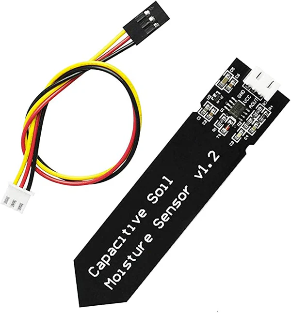

**Description**

This section compares and selects key parts used in the soil moisture subsystem. Each component was chosen based on performance, compatibility with the circuit, cost, and ease of integration. The final selections provide accurate sensing and reliable operation while keeping the design simple and efficient.

*Table 1: Soil Moisture Component Options

**Soil Moisture Sensor (Subsystem)**

| **Solution**                                                                                                                                                                                      | **Pros**                                                                                                                                    | **Cons**                                                                                            |
| ------------------------------------------------------------------------------------------------------------------------------------------------------------------------------------------------- | ------------------------------------------------------------------------------------------------------------------------------------------- | --------------------------------------------------------------------------------------------------- |
|  Option 1.  DFRobot Capacitive Soil Moisture Sensor v1.2 (Analog) $10/each [link to product](https://www.dfrobot.com/product-1385.html)                 | \* Capacitive design resists corrosion better  \* Simple analog voltage output compatible with microcontroller ADCs  \* Wide community support, documentation, and example circuits                                               | \* Analog signal can fluctuate with noise  \* Cable length can introduce noise without shielding  \* Not fully waterproof out of the box |
|  \* Option 2.  \* Adafruit STEMMA Soil Sensor (Digital Capacitive)  \* $7.50/each  \* [Link to product](https://www.adafruit.com/product/4026) | \* Provides digital I²C output, reducing analog noise  \* Built in temperature sensing for compensation   \* Easy connection via STEMMA system | * Requires I²C communication setup and address management  \* Needs level shifting if using a 5 V microcontroller  \* Higher cost compared to analog sensors                                                          |
|  Option 3.  SunFounder Capacitive Soil Moisture Sensor Module $7/each [link to product](https://www.sunfounder.com/products/capacitive-soil-moisture-sensor-module?variant=44245636677867&country=US&currency=USD&utm_source=chatgpt.com)                 | \* Capacitive design (better durability vs resistive probes) \* compatible with most microcontrollers \* Analog output, so it plugs into ADC input easily                                                | \* Output may suffer from noise, especially with long wires  \* CNot completely waterproof unless sealed  \* Needs calibration per soil type and environment |

**Rationale** 

The Sunfounder capacitive soil moisture sensor option 3 was chosen because it is simple, reliable, and works well with our system.

* Uses an analog signal that connects directly to the microcontroller’s ADC.

* Has a corrosion resistant design for better durability and long-term use.

* Works with our 5 V power supply.

* Easy to set up, affordable, and well supported with documentation.
