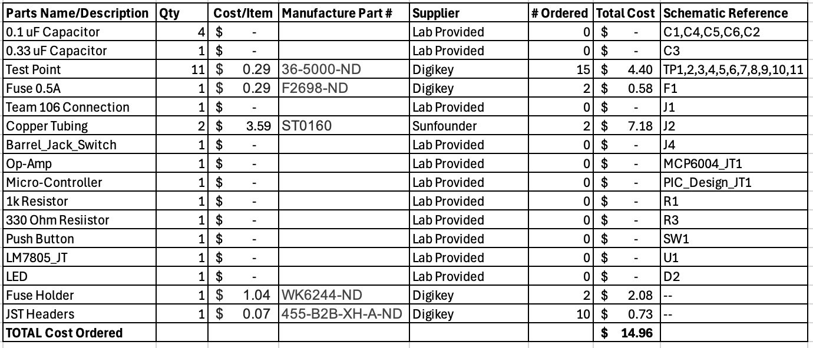

## Overview
This Bill of Materials lists all the main parts used in my soil moisture sensor subsystem. Most components, such as the resistors, capacitors, op amp, and microcontroller, were provided by the lab. The copper tubing used for the soil probes was purchased from Ace Hardware. The other items I ordered, including the JST headers, fuse holder, and test points, were ordered from DigiKey. The total cost of the parts I purchased was $14.96, which stays under budget.

## Bill of Materials

**Figure 1:** *List of components used on the soil moisture system*