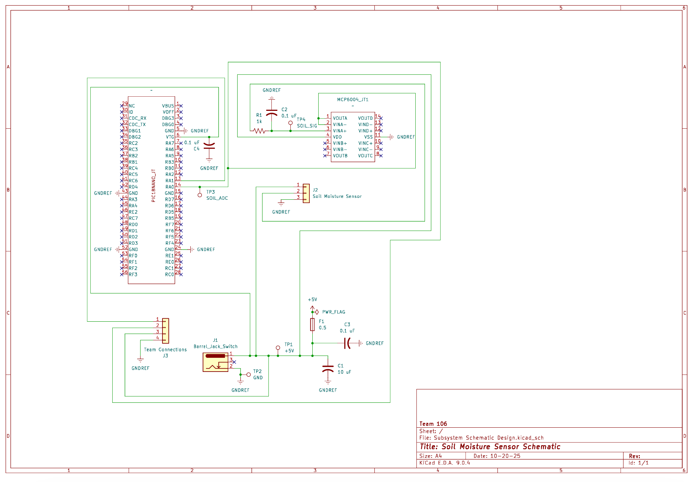

## Overview

This schematic is designed to support a soil moisture sensing subsystem powered by a 9V barrel jack, regulated to 5V, all while using an MCP6004 op-amp and PIC18F57Q43 microcontroller. It conditions the sensor’s analog signal for ADC input, provides stable power through a fused and filtered supply, and includes connectors for team integration and testing.

{style width:"350" height:"300;"}
**Figure 02:** Soil Moisture Schematic

## Resouces

The schematic as a PDF download is available [*here*](106_JT_Harrison.pdf), and the Zip folder of the project [*here*](ECADSOIL.zip)