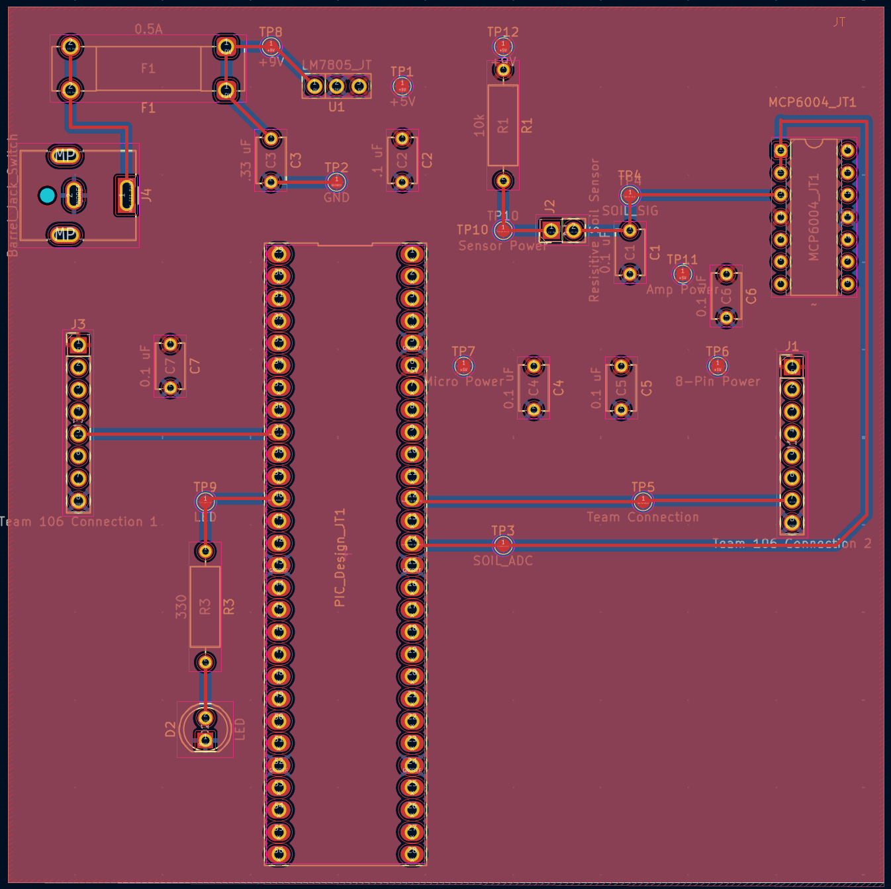

## Overview

This PCB layout shows the front and back design of my soil moisture sensing subsystem. It includes all major components such as the voltage regulator, op amp, microcontroller, and connectors for team integration. The layout provides clear routing for power, ground, and signal paths to ensure stable performance and easy testing within the full plant monitoring system.

## PCB (Front)

## PCB (Back)

## Resouces

The PCB (Front) as a PDF download is available [*here*](top.pdf), and the PCB (Back) [*here*](bot.pdf).

The Zip folder of the Gerber [*here*](Harrison.JT.zip)
The Zip folder of ECAD project [*here*](entire.zip)
